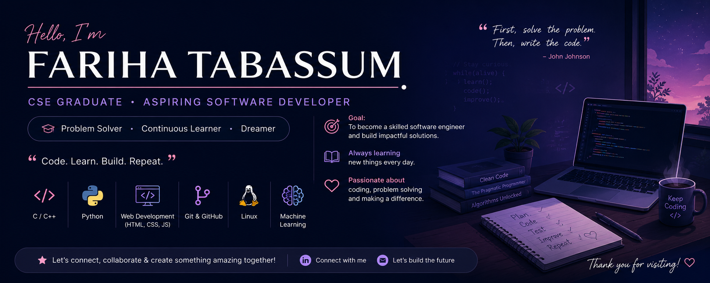

  

<h1 align="center">Hi 👋, I'm Fariha Tabassum</h1>

<h3 align="center">
CSE Graduate • Aspiring Software Developer • Bangladesh 🇧🇩
</h3>

---

## 👩‍💻 About Me

🎓 CSE Graduate from **Bangladesh Army International University of Science and Technology (BAIUST)**

🌱 Currently learning

- Python
- Web Development
- Git & GitHub
- Linux

💡 Interested in

- Software Engineering
- Machine Learning
- Problem Solving
- Open Source

🎯 Goal

Become a skilled Software Engineer and build useful real-world applications.

---

## 🛠 Tech Stack

---

## 📊 GitHub Stats

---

## 💻 Most Used Languages

---

## 🏆 GitHub Trophies

---

## 📈 Contribution Graph

---

## 📫 Connect With Me

📧 Email: farihamahi6132@gmail.com

⭐ Thank you for visiting my profile!

